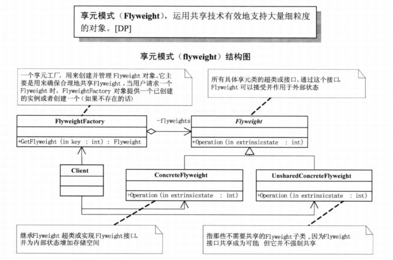

# Flyweight Pattern

享元模式：运功共享技术有效的支持大量细粒度的对象。  



# Implementation

该示例展示了网站对细粒度对象的共享

## Interface

```
package flyweight

type IUser interface {
	GetUsername() string
}

type WebSite interface {
	Use(user IUser) error
}

type Factory interface {
	GetWebSiteCategory(key string) WebSite
	GetWebSiteCount() int
}
```

## Different Implementations

```
// 具体网站类
type concreteWebSite struct {
	key string
}

func createConcreteWebsite(key string) flyweight.WebSite {
	cw := new(concreteWebSite)
	cw.key = key
	return cw
}

func (cw *concreteWebSite) Use(u flyweight.IUser) error {
	fmt.Println("网站分类：", cw.key, " 用户：", u.GetUsername())
	return nil
}
```

```
// 用户类
type user struct {
	name string
}

func CreateUser(name string) flyweight.IUser {
	u := new(user)
	u.name = name
	return u
}

func (u *user) GetUsername() string {
	return u.name
}
```

```
// 网站工厂类
type webSiteFactory struct {
	mp map[string]flyweight.WebSite
}

var once sync.Once
var instance *webSiteFactory
func GetWebSiteFactory() flyweight.Factory {
	once.Do(func() {
		instance = new(webSiteFactory)
		instance.mp = make(map[string]flyweight.WebSite)
	})
	return instance
}

func (p *webSiteFactory) GetWebSiteCategory(key string) flyweight.WebSite {
	if _,ok := p.mp[key]; !ok {
		p.mp[key] = createConcreteWebsite(key)
	}
	return p.mp[key]
}

func (p *webSiteFactory) GetWebSiteCount() int {
	return len(p.mp)
}
```

# Usage

```
f := handle.GetWebSiteFactory()

fx := f.GetWebSiteCategory("产品展示")
fx.Use(handle.CreateUser("小菜"))
fx.Use(handle.CreateUser("大鸟"))

fy := f.GetWebSiteCategory("产品展示")
fy.Use(handle.CreateUser("娇娇"))

fz := f.GetWebSiteCategory("博客")
fz.Use(handle.CreateUser("老顽童"))

fm := f.GetWebSiteCategory("博客")
fm.Use(handle.CreateUser("桃谷六仙"))

fn := f.GetWebSiteCategory("博客")
fn.Use(handle.CreateUser("南海鳄神"))

fmt.Println("得到的网站分类总数：", f.GetWebSiteCount())
```

# Rules of Thumb

如果一个应用程序使用了大量的对象，而大量的这些对象造成了很大的存储开销是就应该考虑使用；还有就是对象的大多数状态可以外部状态，如果删除对象外部状态，那么可以用相对较少的共享对象取代很多组对象，此时可以考虑使用享元模式。
